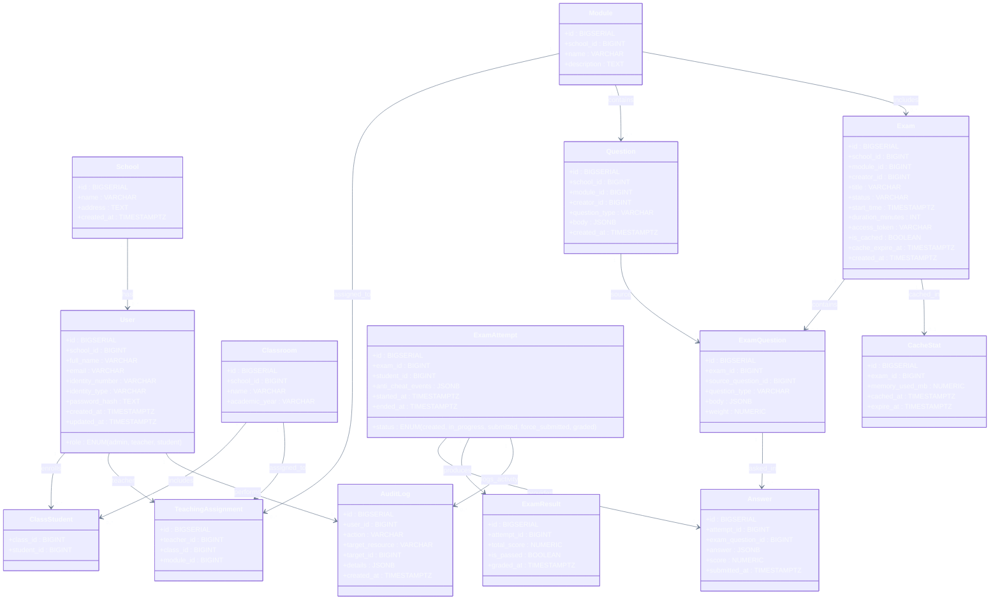

```mermaid
%%{init: {"themeVariables": { "primaryColor": "#1e293b", "primaryTextColor": "#e2e8f0", "lineColor": "#64748b", "tertiaryColor": "#0f172a", "secondaryColor": "#334155", "noteBkgColor": "#1e293b", "noteTextColor": "#f8fafc", "classText": "#f8fafc"}}}%%
classDiagram

class School {
  +id : BIGSERIAL
  +name : VARCHAR
  +address : TEXT
  +created_at : TIMESTAMPTZ
}

class User {
  +id : BIGSERIAL
  +school_id : BIGINT
  +full_name : VARCHAR
  +email : VARCHAR
  +identity_number : VARCHAR
  +identity_type : VARCHAR
  +password_hash : TEXT
  +role : ENUM(admin, teacher, student)
  +created_at : TIMESTAMPTZ
  +updated_at : TIMESTAMPTZ
}

School "1" --> "0..*" User : has

class Module {
  +id : BIGSERIAL
  +school_id : BIGINT
  +name : VARCHAR
  +description : TEXT
}

class Classroom {
  +id : BIGSERIAL
  +school_id : BIGINT
  +name : VARCHAR
  +academic_year : VARCHAR
}

class ClassStudent {
  +class_id : BIGINT
  +student_id : BIGINT
}

Classroom "1" --> "0..*" ClassStudent : includes
User "1" --> "0..*" ClassStudent : enrolls

class TeachingAssignment {
  +id : BIGSERIAL
  +teacher_id : BIGINT
  +class_id : BIGINT
  +module_id : BIGINT
}

User "1" --> "0..*" TeachingAssignment : teacher
Classroom "1" --> "0..*" TeachingAssignment : assigned_to
Module "1" --> "0..*" TeachingAssignment : assigned_to

class Question {
  +id : BIGSERIAL
  +school_id : BIGINT
  +module_id : BIGINT
  +creator_id : BIGINT
  +question_type : VARCHAR
  +body : JSONB
  +created_at : TIMESTAMPTZ
}

class Exam {
  +id : BIGSERIAL
  +school_id : BIGINT
  +module_id : BIGINT
  +creator_id : BIGINT
  +title : VARCHAR
  +status : VARCHAR
  +start_time : TIMESTAMPTZ
  +duration_minutes : INT
  +access_token : VARCHAR
  +is_cached : BOOLEAN
  +cache_expire_at : TIMESTAMPTZ
  +created_at : TIMESTAMPTZ
}

class ExamQuestion {
  +id : BIGSERIAL
  +exam_id : BIGINT
  +source_question_id : BIGINT
  +question_type : VARCHAR
  +body : JSONB
  +weight : NUMERIC
}

Module "1" --> "0..*" Question : contains
Module "1" --> "0..*" Exam : includes
Exam "1" --> "0..*" ExamQuestion : contains
Question "1" --> "0..*" ExamQuestion : source

class ExamAttempt {
  +id : BIGSERIAL
  +exam_id : BIGINT
  +student_id : BIGINT
  +status : ENUM(created, in_progress, submitted, force_submitted, graded)
  +anti_cheat_events : JSONB
  +started_at : TIMESTAMPTZ
  +ended_at : TIMESTAMPTZ
}

class Answer {
  +id : BIGSERIAL
  +attempt_id : BIGINT
  +exam_question_id : BIGINT
  +answer : JSONB
  +score : NUMERIC
  +submitted_at : TIMESTAMPTZ
}

ExamAttempt "1" --> "0..*" Answer : provides
ExamQuestion "1" --> "0..*" Answer : asked_in

class ExamResult {
  +id : BIGSERIAL
  +attempt_id : BIGINT
  +total_score : NUMERIC
  +is_passed : BOOLEAN
  +graded_at : TIMESTAMPTZ
}

ExamAttempt "1" --> "1" ExamResult : produces

class CacheStat {
  +id : BIGSERIAL
  +exam_id : BIGINT
  +memory_used_mb : NUMERIC
  +cached_at : TIMESTAMPTZ
  +expire_at : TIMESTAMPTZ
}

Exam "1" --> "0..1" CacheStat : cached_in

class AuditLog {
  +id : BIGSERIAL
  +user_id : BIGINT
  +action : VARCHAR
  +target_resource : VARCHAR
  +target_id : BIGINT
  +details : JSONB
  +created_at : TIMESTAMPTZ
}

User "1" --> "0..*" AuditLog : performs
ExamAttempt "1" --> "0..*" AuditLog : logs_activity
```
