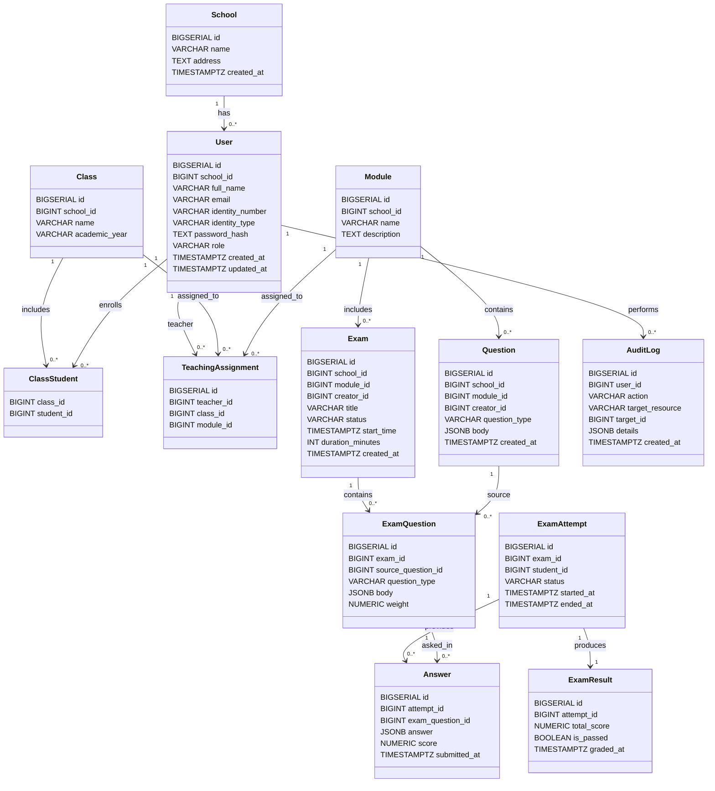

#SC : mermaid.live
#preview : cmd+shift+v

```mermaid
classDiagram
    %% Schools and Users
    class School {
        BIGSERIAL id
        VARCHAR name
        TEXT address
        TIMESTAMPTZ created_at
    }
    class User {
        BIGSERIAL id
        BIGINT school_id
        VARCHAR full_name
        VARCHAR email
        VARCHAR identity_number
        VARCHAR identity_type
        TEXT password_hash
        VARCHAR role
        TIMESTAMPTZ created_at
        TIMESTAMPTZ updated_at
    }
    School "1" --> "0..*" User : has

    %% Modules and Classes
    class Module {
        BIGSERIAL id
        BIGINT school_id
        VARCHAR name
        TEXT description
    }
    class Class {
        BIGSERIAL id
        BIGINT school_id
        VARCHAR name
        VARCHAR academic_year
    }

    %% Class-Student mapping
    class ClassStudent {
        BIGINT class_id
        BIGINT student_id
    }
    Class "1" --> "0..*" ClassStudent : includes
    User "1" --> "0..*" ClassStudent : enrolls

    %% Teaching Assignments
    class TeachingAssignment {
        BIGSERIAL id
        BIGINT teacher_id
        BIGINT class_id
        BIGINT module_id
    }
    User "1" --> "0..*" TeachingAssignment : teacher
    Class "1" --> "0..*" TeachingAssignment : assigned_to
    Module "1" --> "0..*" TeachingAssignment : assigned_to

    %% Questions and Exams
    class Question {
        BIGSERIAL id
        BIGINT school_id
        BIGINT module_id
        BIGINT creator_id
        VARCHAR question_type
        JSONB body
        TIMESTAMPTZ created_at
    }
    class Exam {
        BIGSERIAL id
        BIGINT school_id
        BIGINT module_id
        BIGINT creator_id
        VARCHAR title
        VARCHAR status
        TIMESTAMPTZ start_time
        INT duration_minutes
        TIMESTAMPTZ created_at
    }
    class ExamQuestion {
        BIGSERIAL id
        BIGINT exam_id
        BIGINT source_question_id
        VARCHAR question_type
        JSONB body
        NUMERIC weight
    }
    Module "1" --> "0..*" Question : contains
    Module "1" --> "0..*" Exam : includes
    Exam "1" --> "0..*" ExamQuestion : contains
    Question "1" --> "0..*" ExamQuestion : source

    %% Exam Attempts and Answers
    class ExamAttempt {
        BIGSERIAL id
        BIGINT exam_id
        BIGINT student_id
        VARCHAR status
        TIMESTAMPTZ started_at
        TIMESTAMPTZ ended_at
    }
    class Answer {
        BIGSERIAL id
        BIGINT attempt_id
        BIGINT exam_question_id
        JSONB answer
        NUMERIC score
        TIMESTAMPTZ submitted_at
    }
    ExamAttempt "1" --> "0..*" Answer : provides
    ExamQuestion "1" --> "0..*" Answer : asked_in

    class ExamResult {
        BIGSERIAL id
        BIGINT attempt_id
        NUMERIC total_score
        BOOLEAN is_passed
        TIMESTAMPTZ graded_at
    }
    ExamAttempt "1" --> "1" ExamResult : produces

    %% Audit Logs
    class AuditLog {
        BIGSERIAL id
        BIGINT user_id
        VARCHAR action
        VARCHAR target_resource
        BIGINT target_id
        JSONB details
        TIMESTAMPTZ created_at
    }
    User "1" --> "0..*" AuditLog : performs
```
